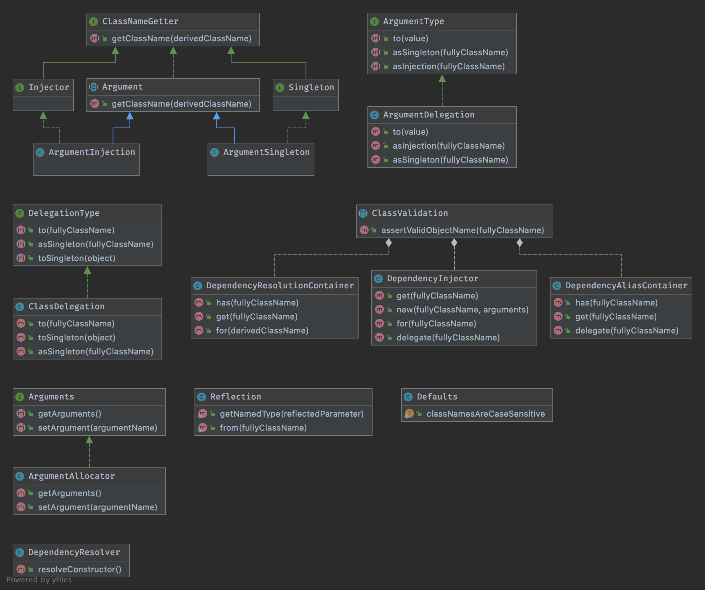

# YEDI - Yet enough dependency injectors

This is a small and easy dependency injection (also called DI) framework.

##### Features:

- Fluent-speaking interface
- Containers are PSR-11 compatible...
- Use of data structure map (see https://www.php.net/manual/en/class.ds-map.php)
- Delegate classes / interfaces or traits to another and concrete class (see "Use of Alias Container")
- Instantiating dependencies with configured constructor arguments (see "Use of Resolution Container")
- Use singleton behaviour without using it as an anti-pattern (each class can only exist once if you want to)
- DI Getter trait

#### Use of Injector:

Whenever you want to inject a dependent class, you can use a DI.

First of all, this is not really cumbersome:

    $di = new JayBeeR\YEDI\DependencyInjector;
    $object = $di->get(My\Own\Class::class);
        

Each classes will be constructed internally using the pure DI method:

    class MyOwnClass
    {
        protected My\Own\Interface $stuff;
        
        public function __construct(My\Own\OtherClass $stuff)
        {
            $this->stuff = $stuff;
        }
    }
    
    $di = new JayBeeR\YEDI\DependencyInjector;
    $myClass = $di->get(MyOwnClass::class);

The given class type in the constructor argument `$stuff` will be reflected automatically and make a DI delegation
before instantiating the requested class.

You can use this class in any form without a DI:

    $dependentClass = new My\Own\OtherClass;
    $myClass = new MyOwnClass($dependentClass);

You can use the getter trait in your own class (but be careful with it):

    class MyOwnClass
    {
        use JayBeeR\YEDI\DependencyInjectorGetter;
        
        protected My\Own\Interface $stuff;
        
        public function injectDependencies()
        {
            $this->stuff = $this->get(My\Own\OtherClass::class);
        }
    }
    
     
(!) YEDI classes can only have the trait constructor. This is because you couldn't easily use the same DI in this class
without further implementation. You have to pass an existing DI to that class. Unlovely: An additional argument would
only make it more difficult to construct the class. Therefore, we only use the trait constructor for the transfer of
the DI. Everything else is injected using the abstract method named "injectDependencies".

You can use it, but ... you only become unnecessarily dependent on the DI. 

        
#### Use of Alias Container:

The alias container should be used for the mapping of classes to be overwritten. That should be (abstract) classes,
interfaces or traits.

    $di = new JayBeeR\YEDI\DependencyInjector;
    $di->delegate(ForeignClass::class)     ->to(MyExtendedClass::class);
    $di->delegate(ForeignInterface::class) ->to(MyClassWithThisInterface::class);
    $di->delegate(ForeignTrait::class)     ->to(MyClassWithThisTrait::class);

You can use it as follows:
        
    $myExtendedClass = $di->get(ForeignClass::class);
    $myClassWithThisInterface = $di->get(ForeignInterface::class);
    $myClassWithThisTrait = $di->get(ForeignTrait::class);

From the outside the class, you now have control over the internally dependencies without have to extend this class.

However, you have more support with YEDI. Continue reading.

#### Use of Resolution Container:

The resolution container should be used for the instantiating of a dependency class with concrete constructor arguments. 

    class ForeignClass {
        public function __construct(
            string $name, 
            Foreign\HelperInterface $helper, 
            int $limit,
            bool $hidden,
            Foreign\Service $service
        );
    }

    $di = new JayBeeR\YEDI\DependencyInjector;
    $di->for(ForeignClass::class)
        ->setArgument('limit')  ->to(123)
        ->setArgument('name')   ->to('value')
        ->setArgument('helper') ->asInjection(My\Own\Helper::class)
        ->setArgument('hidden') ->to(false)
        ->setArgument('service') ->asSingleton(My\Own\Service::class)
    ;
    
    $foreignClass = $di->get(ForeignClass::class);
    
    
That would be the same as with the following implementation:
    
    $dependentHelper = new My\Own\Helper;
    
    // should return singleton instance via Factory
    $service = Foreign\Service::get(); 
    
    $object = new ForeignClass(123, 'value', $dependentHelper, false, $service);
       
       
But why you should use this?

Let's imagine that you have two classes that describe different implementations for an interface.

With the alias support from YEDI, however, you cannot delegate this interface to both classes.

This is the case:

    class MyClassA
    {
        public function __construct(ForeignInterface $interface);
    }

    class MyClassB
    {
        public function __construct(ForeignInterface $interface);
    }

That is the solution:

    $di = new JayBeeR\YEDI\DependencyInjector;
    $di->for(MyClassA::class)
        ->setArgument('interface')
        ->asInjection(MyClassInterfaceA::class)
    ;

    $di->for(MyClassB::class)
        ->setArgument('interface')
        ->asInjection(MyClassInterfaceB::class)
    ;
    
    
You can now instantiate with the simple class name:

    $di = new JayBeeR\YEDI\DependencyInjector;

    // constructor argument with MyClassInterfaceA
    $myClassA = $di->get(MyClassA::class); 
    
    // constructor argument with MyClassInterfaceB
    $myClassB = $di->get(MyClassB::class); 
    

#### Use of Singleton classes

Sometimes you want to ensure that certain classes cannot be instantiated multiple times. This is what the Singleton 
design pattern stands for. It is also called an anti-pattern, because of several disadvantages.

You can use a singleton instance without this pattern:

    $di = new JayBeeR\YEDI\DependencyInjector;
    
    // Global Singleton delegation
    $di->delegate(Foreign\Class:class)->asSingleton(); // via ReflectionType
    $di->delegate(Foreign\Class:class)->asSingleton(MyOwn\Class::class);
    
    // Local Singleton delegation
    $di->for(Foreign\Class:class)->setArgument('service')->asSingleton(); // via ReflectionType
    $di->for(Foreign\Class:class)->setArgument('service')->asSingleton(MyOwn\Service::class);

(!) Caution should be exercised when using singleton, because these are not generated immediately, but only when they
are requested via the DI for the first time. The order here can depend on when other instances will be created.

## Wishlist

- Refactoring and renaming things (clear interface)
- Description for all exceptions <3
- Tests for all exceptions
- Throws more Exceptions?

## PDepend

- NOP - Number Of Packages
- NOC - Number Of Classes
- NOM - Number Of Methods
- LOC – Lines of Code
- CYCLO - Cyclomatic complexity
- CALLS - number of distinct function- and method-calls
- ANDC - Average Number of Derived Classes
- AHH - Average Hierarchy Height

